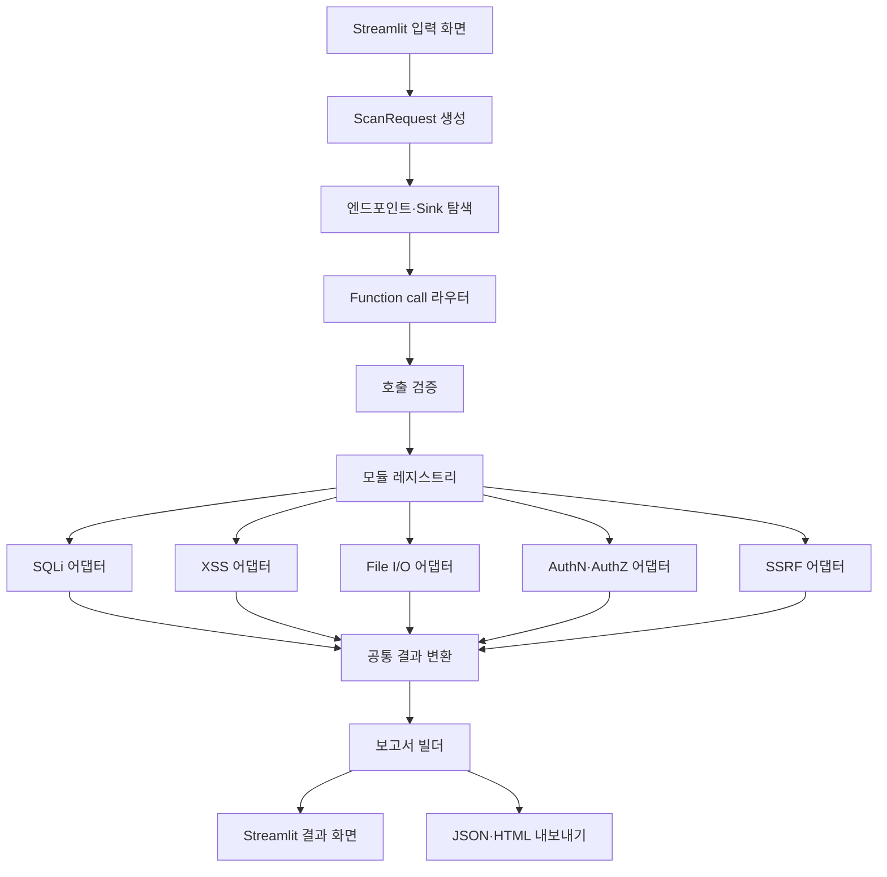

# ROOKIESCAN 통합 구조 설계

## 1. 목표

Streamlit에서 점검 대상을 입력받고, 발견된 엔드포인트와 파라미터를 기준으로
SQL Injection, XSS, 파일 업로드·다운로드, 인증·인가, SSRF 모듈을 호출한다.
각 모듈의 서로 다른 결과는 공통 형식으로 변환한 뒤 하나의 보안 점검 보고서로 만든다.

이 문서는 구현 전에 모듈 경계와 데이터 계약을 정하기 위한 설계 문서다.

## 2. 전체 흐름



## 3. 디렉터리 구조

현재 각 브랜치의 스캐너 코드는 그대로 유지한다. 통합 단계에서 아래 구조로 옮기거나
어댑터로 연결한다. 이번 브랜치에서는 실행 파일과 모듈 코드를 만들지 않는다.

```text
Automatic-scanner-tool/
├─ streamlit_app.py                 # 향후 Streamlit 진입점
├─ rookiescan/
│  ├─ ui/                           # 입력 폼, 진행 상태, 결과 표시
│  ├─ core/
│  │  ├─ models.py                  # ScanRequest, Endpoint, Finding, ScanReport
│  │  ├─ orchestrator.py            # 전체 점검 순서와 상태 관리
│  │  ├─ discovery.py               # 엔드포인트와 Sink 후보 수집
│  │  └─ registry.py                # 사용 가능한 스캐너와 어댑터 등록
│  ├─ routing/
│  │  ├─ function_router.py         # OpenAI function call 요청·응답 처리
│  │  └─ validation.py              # 허용된 도구, URL, 메서드, 범위 검증
│  ├─ scanners/
│  │  ├─ sqli/adapter.py
│  │  ├─ xss/adapter.py
│  │  ├─ fileio/adapter.py
│  │  ├─ authn/adapter.py
│  │  ├─ authz/adapter.py
│  │  └─ ssrf/adapter.py
│  └─ reporting/
│     ├─ builder.py                 # 결과 집계와 ScanReport 생성
│     └─ renderers/                 # JSON, HTML 출력기
├─ schemas/                         # 구현 언어와 분리된 공통 데이터 계약
├─ docs/
├─ tests/                           # 향후 계약·어댑터 중심 테스트
└─ output/                          # 생성된 보고서, Git 제외
```

초기 구현에서는 Streamlit 화면을 여러 페이지로 나누지 않고 하나의 입력 화면과 하나의
결과 화면으로 시작한다. 화면이 복잡해질 때만 `ui/pages/`를 추가한다.

## 4. 컴포넌트 책임

### Streamlit UI

입력과 표시만 담당한다. 입력 폼에서는 다음 값을 받는다.

- 대상 이름과 기준 URL
- 허용된 점검 범위
- 인증 프로필 참조값
- 사용할 스캐너 목록
- 타임아웃과 동시 실행 수 같은 실행 옵션
- 대상에 대한 점검 권한 확인

입력값은 한 번에 제출되도록 `st.form`을 사용한다. Streamlit은 위젯 상호작용마다
스크립트를 다시 실행하므로 현재 요청, 진행 상태, 최종 보고서는 `st.session_state`에
보관한다.

참고 문서:

- https://docs.streamlit.io/develop/concepts/architecture/forms
- https://docs.streamlit.io/develop/concepts/architecture/session-state

### Orchestrator

UI나 개별 스캐너의 세부 구현을 알지 않는다. 다음 순서만 관리한다.

1. `ScanRequest` 검증
2. 엔드포인트와 Sink 후보 수집
3. function call 라우팅 요청
4. 반환된 호출의 범위와 인자 검증
5. 등록된 어댑터 실행
6. 결과 정규화
7. 보고서 생성

### Function call 라우터

AI는 스캐너 코드를 직접 실행하지 않는다. 애플리케이션이 제공한 도구 목록 중 어떤
도구를 어떤 엔드포인트에 적용할지만 선택한다. 실제 함수 실행은 애플리케이션이 한다.

라우터에 전달하는 정보는 다음으로 제한한다.

- 엔드포인트 ID
- HTTP 메서드
- 파라미터 이름과 위치
- Sink 후보와 발견 근거
- 사용할 수 있는 스캐너 도구 목록

쿠키, 비밀번호, API 키는 모델 입력과 function call 인자에 넣지 않는다. 모델은
`endpoint_id`를 반환하고, 애플리케이션이 해당 ID로 원본 URL과 인증 프로필을 조회한다.

도구 예시는 다음과 같다.

| 도구 이름 | 선택 기준 | 주요 인자 |
|---|---|---|
| `scan_sqli` | DB 질의에 도달할 가능성이 있는 입력 | `endpoint_ids`, `parameter_names`, `reason` |
| `scan_xss` | HTML·DOM 출력에 반영될 가능성이 있는 입력 | `endpoint_ids`, `parameter_names`, `reason` |
| `scan_fileio` | 업로드·다운로드·파일 경로 입력 | `endpoint_ids`, `parameter_names`, `reason` |
| `scan_authn` | 로그인과 세션 경계 | `endpoint_ids`, `reason` |
| `scan_authz` | 객체 ID와 권한 경계 | `endpoint_ids`, `parameter_names`, `reason` |
| `scan_ssrf` | 서버 측 URL 요청 후보 | `endpoint_ids`, `parameter_names`, `reason` |

도구 인자는 JSON Schema로 제한하고 strict mode를 사용한다. 선택 결과는 항상
애플리케이션에서 다시 검증한다.

OpenAI function calling의 실행 순서와 strict schema 규칙은 아래 문서를 기준으로 한다.

- https://developers.openai.com/api/docs/guides/function-calling

AI 호출이 실패하면 사용자가 선택한 스캐너와 Sink 규칙표로 실행 계획을 만든다.
라우팅 실패 때문에 전체 점검이 중단되지 않도록 한다.

### 호출 검증

각 function call은 실행 전에 다음을 확인한다.

- 등록된 도구 이름인가
- 요청한 엔드포인트가 현재 `ScanRequest`에 포함되는가
- URL이 허용된 origin과 범위 안에 있는가
- HTTP 메서드가 허용 목록에 있는가
- 요청한 파라미터가 해당 엔드포인트에 실제로 존재하는가
- 인증 프로필이 현재 점검에서 사용 허가된 참조값인가

### 모듈 어댑터

각 스캐너의 기존 함수명, 설정 파일, 출력 형식 차이는 어댑터가 흡수한다. 공통 호출
계약은 아래와 같다.

```text
scan(ModuleScanRequest) -> ModuleResult
```

`ModuleScanRequest`에는 URL, 메서드, 파라미터, 인증 프로필 참조, 제한 시간, 스캔 ID가
들어간다. `ModuleResult`에는 모듈 상태, 공통 Finding 목록, 오류와 실행 통계가 들어간다.

기존 스캐너 내부를 먼저 통일하지 않는다. 모듈마다 작은 어댑터 한 개를 두고 공통
형식으로 변환한다.

### 결과 정규화

모듈별 판정값은 다음 값으로 통일한다.

| 공통 판정 | 의미 | 기존 값 예시 |
|---|---|---|
| `VULNERABLE` | 취약 증거 확인 | `VULNERABLE` |
| `REVIEW` | 자동 판정이 불충분해 수동 확인 필요 | `POTENTIAL` |
| `PASS` | 수행한 범위에서 취약 증거가 없거나 차단됨 | `SAFE`, `PASS` |
| `INFO` | 판정이 아닌 관찰 정보 | `INFO` |
| `ERROR` | 설정, 통신, 실행 오류 | `ERROR` |
| `SKIPPED` | 조건 부족 또는 미선택으로 미수행 | `SKIPPED` |

심각도는 `CRITICAL`, `HIGH`, `MEDIUM`, `LOW`, `INFO`로 통일한다.

## 5. 데이터 계약

설계 단계의 공통 계약은 다음 파일에 둔다.

- `schemas/scan-request.schema.json`: Streamlit에서 오케스트레이터로 넘기는 요청
- `schemas/finding.schema.json`: 모든 스캐너가 반환해야 하는 발견 결과
- `schemas/scan-report.schema.json`: 보고서 빌더의 최종 결과

설계상 핵심 타입은 다음과 같다.

```text
ScanRequest
  scan_id
  target
  authorization
  auth_profile_ref
  selected_modules[]
  endpoints[]
  options

Endpoint
  endpoint_id
  url
  method
  parameters[]
  sink_hints[]

Finding
  finding_id
  scanner_id
  title
  vulnerability_type
  verdict
  severity
  confidence
  endpoint
  parameter
  evidence
  impact
  reproduction[]
  remediation[]
  details
```

## 6. 상태와 실패 처리

스캔 상태는 `PENDING`, `DISCOVERING`, `ROUTING`, `SCANNING`, `REPORTING`,
`COMPLETED`, `FAILED`로 관리한다. 한 모듈이 실패해도 나머지 모듈 결과로 보고서를
만들고, 실패한 모듈은 `module_runs`와 `errors`에 기록한다.

같은 `scan_id`, `scanner_id`, `endpoint_id` 조합은 중복 실행을 피하도록 실행 계획에서
한 번만 만든다. Streamlit 재실행 때문에 동일 점검이 다시 시작되지 않게 현재 상태를
세션에 저장한다.

## 7. 구현 순서

1. 공통 모델과 JSON Schema 확정
2. 기존 모듈별 어댑터 작성
3. AI 없이 수동 모듈 선택으로 오케스트레이터 연결
4. Streamlit 입력과 진행 상태 연결
5. function call 라우터 연결
6. 보고서 JSON과 HTML 출력 연결
7. 통합 테스트 후 각 브랜치 병합

이 순서는 AI 라우팅이 없어도 전체 파이프라인과 보고서가 먼저 동작하도록 잡은 것이다.
